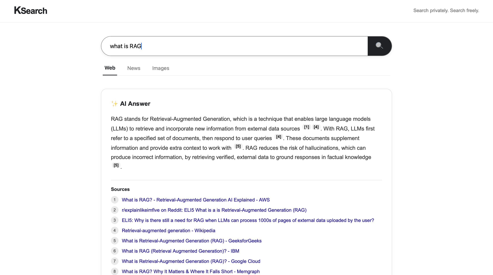
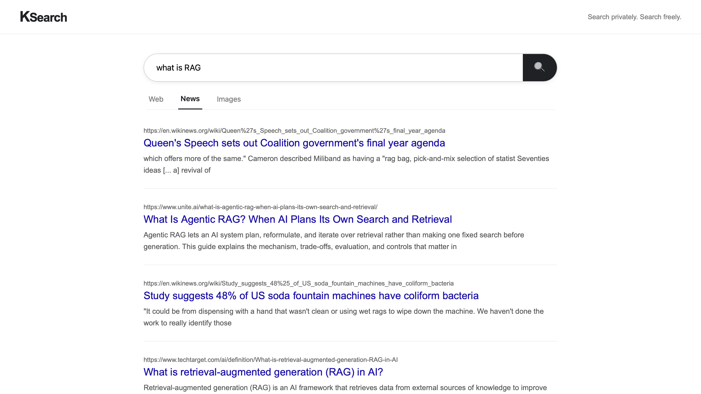
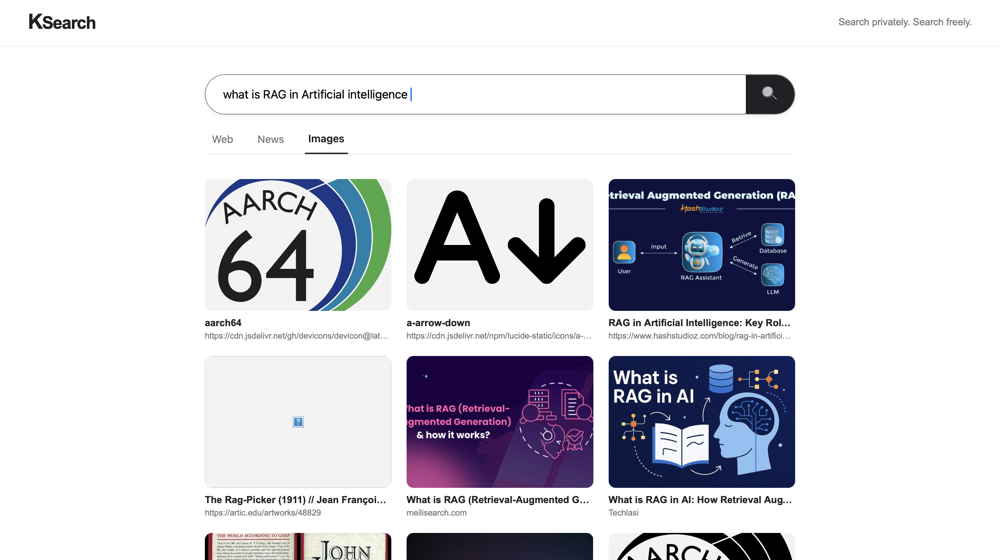

# KSearch 🔎

### Private AI-Powered Search Engine

KSearch is a privacy-focused search engine that combines traditional web search with locally running AI to provide grounded answers with source citations and conversational follow-up questions.

Instead of relying on a centralized search engine and a cloud-based AI service, KSearch uses **SearXNG** for metasearch and **Ollama with Llama 3.2** for locally generated AI responses.

---

## ✨ Features

- 🔎 **Web Search** — Search the web through SearXNG.
- 📰 **News Search** — Search specifically for news.
- 🖼️ **Image Search** — Browse image search results in a visual grid.
- 🤖 **AI Answers** — Generate answers from retrieved search results using a local LLM.
- 📚 **Source Citations** — AI answers include clickable citations linked to supporting sources.
- 💬 **Conversational Follow-ups** — Ask follow-up questions while preserving conversation context.
- 🔐 **Local AI** — Uses Ollama and Llama 3.2 instead of a paid cloud LLM API.
- ⚡ **FastAPI Backend** — Connects the frontend, search engine and AI model.
- 🐳 **Dockerized Infrastructure** — SearXNG and Valkey run through Docker Compose.

---
## 🎥 Demo

### AI-Powered Web Search



### News Search



### Image Search


## 🏗️ Architecture

```text
                     ┌─────────────────┐
                     │   React + Vite  │
                     │    Frontend     │
                     └────────┬────────┘
                              │
                              ▼
                     ┌─────────────────┐
                     │     FastAPI     │
                     │     Backend     │
                     └───────┬─────────┘
                             │
                  ┌──────────┴──────────┐
                  │                     │
                  ▼                     ▼
          ┌──────────────┐      ┌──────────────┐
          │   SearXNG    │      │    Ollama    │
          │              │      │   Llama 3.2  │
          │ Web / News / │      │              │
          │    Images    │      │    Local LLM │
          └──────────────┘      └──────────────┘
                  │                     ▲
                  │                     │
                  └──── Search Results ─┘
Search and AI flow
User Query
    │
    ▼
React Frontend
    │
    ▼
FastAPI /search
    │
    ▼
SearXNG
    │
    ▼
Search Results
    │
    ├──────────────► Display Results
    │
    ▼
FastAPI /ai-answer
    │
    ▼
Ollama
    │
    ▼
Llama 3.2
    │
    ▼
AI Answer + Citations

For follow-up questions, KSearch uses recent conversation context to construct a contextual search query. The original follow-up question and conversation history are then provided to the AI model to generate a context-aware response.

🛠️ Tech Stack
Frontend
React
Vite
JavaScript
CSS
Backend
Python
FastAPI
HTTPX
Search Infrastructure
SearXNG
Valkey
Docker
Docker Compose
AI
Ollama
Llama 3.2

Project Structure

ksearch/
│
├── backend/
│   └── main.py
│
├── frontend/
│   ├── public/
│   └── src/
│       ├── assets/
│       ├── App.jsx
│       ├── App.css
│       ├── index.css
│       └── main.jsx
│
├── searxng/
│   ├── core-config/
│   │   └── settings.yml
│   ├── .env.example
│   └── docker-compose.yml
│
├── .gitignore
└── README.md
🚀 Running Locally
Prerequisites
Make sure you have the following installed:
Node.js
npm
Python 3
Docker
Ollama
1. Clone the repository
git clone https://github.com/karan69420/ksearch.git
cd ksearch

2. Start SearXNG and Valkey
cd searxng
docker compose up -d
SearXNG will be available at:
http://localhost:8080
3. Start Ollama
Make sure Ollama is running and that the model is available:
ollama run llama3.24. Start the FastAPI backend
Open a new terminal:
cd ksearch/backend
If you are using a Python virtual environment:
source venv/bin/activate
Then start FastAPI:
uvicorn main:app --reload
The backend will run at:
http://localhost:8000
5. Start the frontend
Open another terminal:
cd ksearch/frontend
npm install
npm run dev
The frontend will normally be available at:
http://localhost:5173
🔒 Privacy
KSearch is designed around a local-first architecture.
AI responses are generated using a locally running Ollama model rather than requiring a paid cloud LLM API.
Search requests are routed through a self-hosted SearXNG instance.
💡 Why I Built This
KSearch was built to explore how modern AI search systems can combine:
Traditional information retrieval
Metasearch
Local large language models
Retrieval-grounded generation
Conversational context
Source attribution
The project also provided hands-on experience integrating multiple independently running services into a single full-stack application.
🔮 Future Improvements
Possible future improvements include:
Markdown rendering for AI responses
Improved source ranking
Better citation extraction
Search result deduplication
Streaming AI responses
Search history
Advanced conversation management
Authentication
Production deployment
Additional local LLM support
👨‍💻 Author
Karan Shah
Built as a personal project to explore AI-powered search, local LLMs and full-stack application development.
